<div align="center">

<picture><source media="(prefers-color-scheme: dark)" srcset="./assets/hero-dark.svg"></picture>

<br/>

<a href="https://github.com/masked-shinobi"></a>
<a href="https://www.linkedin.com/in/masked-shinobi-30a289377/"></a>
<a href="mailto:maskedprogrammer.in@gmail.com"></a>
<a href="https://drive.google.com/file/d/1QGokMLQhPTLxFkUjbR9Es9ofhuaZsnsl/view?usp=drive_link"></a>
<a href="https://masked-shinobi.github.io/masked-shinobi/"></a>

<br/>

<a href="#about"><b>About</b></a> &nbsp;·&nbsp; <a href="#capabilities"><b>Capabilities</b></a> &nbsp;·&nbsp; <a href="#projects"><b>Projects</b></a> &nbsp;·&nbsp; <a href="#stack"><b>Stack</b></a> &nbsp;·&nbsp; <a href="#activity"><b>Activity</b></a> &nbsp;·&nbsp; <a href="#contact"><b>Contact</b></a>

</div>

<br/>

<picture><source media="(prefers-color-scheme: dark)" srcset="./assets/stats-dark.svg"></picture>

<br/>

## About

<table>
<tr>
<td width="62%" valign="top">

### Design engineer × builder

I build digital products where **creative interfaces meet serious engineering**.

My work spans frontend systems, cloud infrastructure, AI retrieval pipelines, security tooling, mobile apps and algorithmic foundations.

**The goal isn't more technology. It's technology arranged with enough intent that the result feels obvious.**

</td>
<td width="38%" valign="top">

```text
THINK  →  DESIGN  →  BUILD
  ↑                     ↓
LEARN  ←  SHIP    ←  TEST
```

`SRM IST · Chennai`  
`B.Tech CSE · Year 3`  
`Merit Scholarship`

</td>
</tr>
</table>

## Capabilities

<table>
<tr><td width="33%"><picture><source media="(prefers-color-scheme: dark)" srcset="./assets/capability-01-dark.svg"></picture></td><td width="33%"><picture><source media="(prefers-color-scheme: dark)" srcset="./assets/capability-02-dark.svg"></picture></td><td width="33%"><picture><source media="(prefers-color-scheme: dark)" srcset="./assets/capability-03-dark.svg"></picture></td></tr>
<tr><td width="33%"><picture><source media="(prefers-color-scheme: dark)" srcset="./assets/capability-04-dark.svg"></picture></td><td width="33%"><picture><source media="(prefers-color-scheme: dark)" srcset="./assets/capability-05-dark.svg"></picture></td><td width="33%"><picture><source media="(prefers-color-scheme: dark)" srcset="./assets/capability-06-dark.svg"></picture></td></tr>
</table>

## Projects

<table>
<tr><td width="50%"><a href="https://github.com/masked-shinobi/AI-RESUME-ANALYSER"><picture><source media="(prefers-color-scheme: dark)" srcset="./assets/project-01-dark.svg"></picture></a></td><td width="50%"><a href="https://github.com/masked-shinobi/MinorProject_resembler"><picture><source media="(prefers-color-scheme: dark)" srcset="./assets/project-02-dark.svg"></picture></a></td></tr>
<tr><td width="50%"><a href="https://github.com/masked-shinobi/MCQ_test_Maker_website"><picture><source media="(prefers-color-scheme: dark)" srcset="./assets/project-03-dark.svg"></picture></a></td><td width="50%"><a href="https://github.com/masked-shinobi/devops_webapp_cloud"><picture><source media="(prefers-color-scheme: dark)" srcset="./assets/project-04-dark.svg"></picture></a></td></tr>
<tr><td width="50%"><a href="https://github.com/masked-shinobi/CyberSecurity_Web_Centinel"><picture><source media="(prefers-color-scheme: dark)" srcset="./assets/project-05-dark.svg"></picture></a></td><td width="50%"><a href="https://github.com/masked-shinobi/GSAP-website-3d"><picture><source media="(prefers-color-scheme: dark)" srcset="./assets/project-06-dark.svg"></picture></a></td></tr>
<tr><td width="50%"><a href="https://github.com/masked-shinobi/Food-delivery-app-reactnative"><picture><source media="(prefers-color-scheme: dark)" srcset="./assets/project-07-dark.svg"></picture></a></td><td width="50%"><a href="https://github.com/masked-shinobi/Organ-Donation-Platform-BlockChain"><picture><source media="(prefers-color-scheme: dark)" srcset="./assets/project-08-dark.svg"></picture></a></td></tr>
<tr><td width="50%"><a href="https://github.com/masked-shinobi/email-simulator-CN"><picture><source media="(prefers-color-scheme: dark)" srcset="./assets/project-09-dark.svg"></picture></a></td><td width="50%"><a href="https://github.com/masked-shinobi/DSA-C-with-gtest"><picture><source media="(prefers-color-scheme: dark)" srcset="./assets/project-10-dark.svg"></picture></a></td></tr>
<tr><td width="50%"><a href="https://github.com/masked-shinobi/file-manager-app"><picture><source media="(prefers-color-scheme: dark)" srcset="./assets/project-11-dark.svg"></picture></a></td><td width="50%"><a href="https://github.com/masked-shinobi/PTS-Algorithm"><picture><source media="(prefers-color-scheme: dark)" srcset="./assets/project-12-dark.svg"></picture></a></td></tr>
</table>

<details>
<summary><b>More from the lab &nbsp;↓</b></summary>

<br/>

| Build | Direction |
|---|---|
| RAG Architecture | Modular retrieval + prompt synthesis |
| Ecommerce Devin | AI-assisted e-commerce workflow |
| Tic Tac Toe Docker | Minimal container deployment |
| Python Unit Testing | Testing patterns + boundary analysis |
| SRM Placement Compass | DSA + interview preparation |

</details>

## Stack

<picture><source media="(prefers-color-scheme: dark)" srcset="./assets/stack-dark.svg"></picture>

<br/>

<picture><source media="(prefers-color-scheme: dark)" srcset="./assets/telemetry-dark.svg"></picture>

## How I work

<table>
<tr>
<td width="25%" valign="top"><b>01 · Think</b><br/>Architecture before implementation.</td>
<td width="25%" valign="top"><b>02 · Craft</b><br/>Interfaces with purpose.</td>
<td width="25%" valign="top"><b>03 · Verify</b><br/>Tests, edges, failure paths.</td>
<td width="25%" valign="top"><b>04 · Ship</b><br/>Small releases, real feedback.</td>
</tr>
</table>

<details>
<summary><b>Experience &nbsp;↓</b></summary>

<br/>

| | |
|---|---|
| **SRM IST** | B.Tech Computer Science Engineering · Chennai · Merit Scholarship |
| **King Faisal University** | AI / ML research: deep learning experimentation and applied intelligence |
| **CJ Network** | Web Engineering |
| **Infosys** | Python Development |

</details>

<details>
<summary><b>Current focus &nbsp;↓</b></summary>

<br/>

Cloud-native architecture · Retrieval-augmented generation · Developer experience · Cybersecurity interfaces · Algorithms + systems · Production-oriented testing

*make it work → make it understandable → make it worth using*

</details>

## Activity

<div align="center">
<picture>
<source media="(prefers-color-scheme: dark)" srcset="https://raw.githubusercontent.com/masked-shinobi/masked-shinobi/output/github-snake-dark.svg">

</picture>
</div>

## Contact

<div align="center">

### Build something that deserves a system diagram.

<a href="https://github.com/masked-shinobi"></a>
<a href="https://www.linkedin.com/in/masked-shinobi-30a289377/"></a>
<a href="mailto:maskedprogrammer.in@gmail.com"></a>

<sub>SANJAY BASKAR · DESIGN ENGINEER · 2026</sub>

</div>
