

 

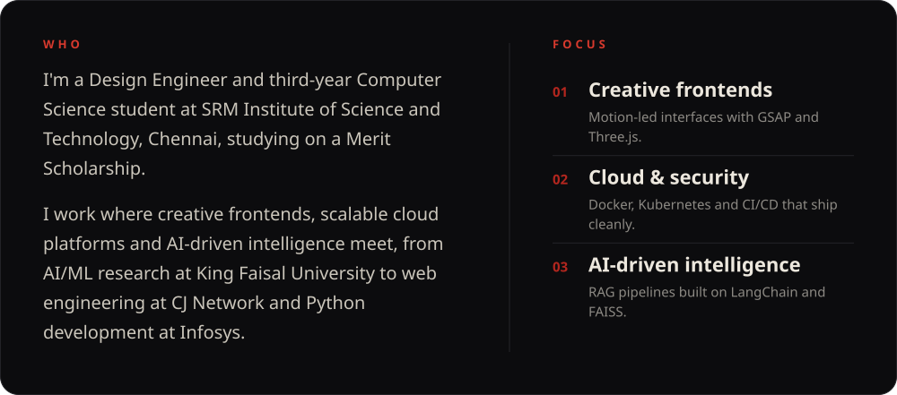

 

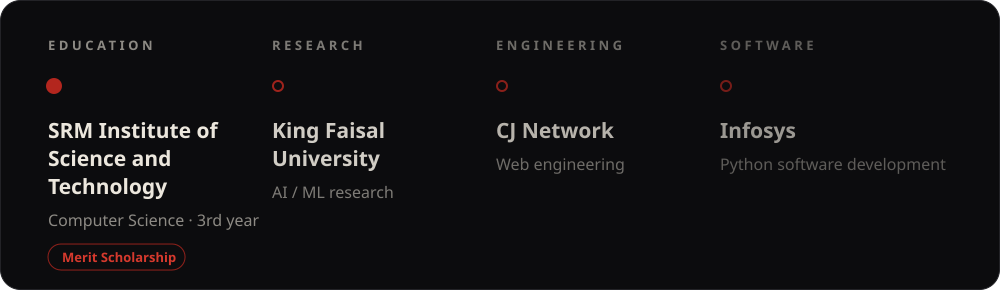

 

 

 

<a href="https://github.com/masked-shinobi/minor_rag_architecture">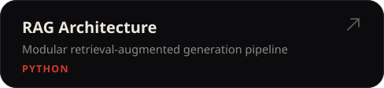</a>
<a href="https://github.com/masked-shinobi/CyberSecurity_Web_Centinel">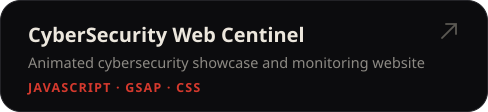</a>
<a href="https://github.com/masked-shinobi/GSAP-website-3d">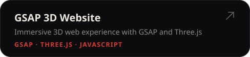</a>
<a href="https://github.com/masked-shinobi/Ecommerce-devin-ai-workflow">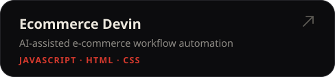</a>
<a href="https://github.com/masked-shinobi/Tic-Tac-Toe-Docker">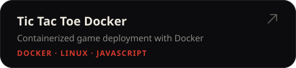</a>
<a href="https://github.com/masked-shinobi/file-manager-app">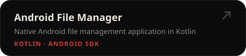</a>
<a href="https://github.com/masked-shinobi/email-simulator-CN">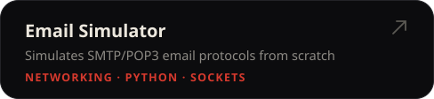</a>
<a href="https://github.com/masked-shinobi/DSA-C-with-gtest">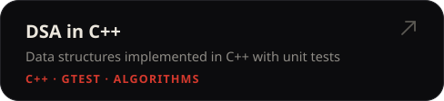</a>
<a href="https://github.com/masked-shinobi/PTS-Algorithm">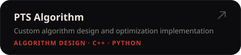</a>
<a href="https://github.com/masked-shinobi/code-unit-testing">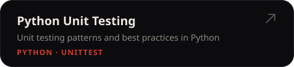</a>
<a href="https://github.com/masked-shinobi/srm-placement-compass">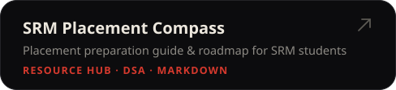</a>
<a href="https://app.notion.com/p/dsa-spreadsheet-sanjaybaskar/73b3a11dd45d8250922601672faf0c8c?v=8d43a11dd45d822db96b08a00fbbd6ef&source=copy_link">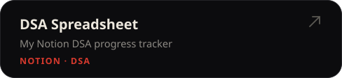</a>

 

 

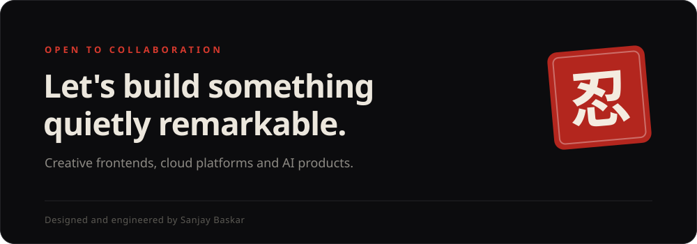

