<div align="center">

<picture><source media="(prefers-color-scheme: dark)" srcset="./assets/hero-dark.svg"></picture>

<br/>

<a href="https://github.com/masked-shinobi"></a> <a href="https://www.linkedin.com/in/masked-shinobi-30a289377/"></a> <a href="mailto:maskedprogrammer.in@gmail.com"></a> <a href="https://drive.google.com/file/d/1QGokMLQhPTLxFkUjbR9Es9ofhuaZsnsl/view?usp=drive_link"></a> <a href="https://masked-shinobi.github.io/masked-shinobi/"></a>

<br/><br/>

<a href="#about"><b>ABOUT</b></a> · <a href="#capabilities"><b>CAPABILITIES</b></a> · <a href="#work"><b>WORK</b></a> · <a href="#stack"><b>STACK</b></a> · <a href="#activity"><b>ACTIVITY</b></a> · <a href="#contact"><b>CONTACT</b></a>

</div>

<br/>

<picture><source media="(prefers-color-scheme: dark)" srcset="./assets/metrics-dark.svg"></picture>

<br/>

## About · <sub>01</sub>

<table><tr><td width="68%" valign="top">

### Design engineer × builder

I build digital products where **creative interfaces meet serious engineering**.

My work spans frontend systems, cloud infrastructure, AI retrieval pipelines, security tooling, mobile apps and algorithmic foundations.

> **The goal isn't more technology. It's technology arranged with enough intent that the result feels obvious.**

</td><td width="32%" valign="top">

```text
THINK  →  DESIGN
  ↑          ↓
LEARN  ←  SHIP
  ↑          ↓
TEST   ←  BUILD
```

`SRM IST · Chennai`  
`B.Tech CSE · Year 3`  
`Merit Scholarship`

</td></tr></table>

## Capabilities · <sub>02</sub>

<table><tr><td width="33%"><picture><source media="(prefers-color-scheme: dark)" srcset="./assets/capability-01-dark.svg"></picture></td><td width="33%"><picture><source media="(prefers-color-scheme: dark)" srcset="./assets/capability-02-dark.svg"></picture></td><td width="33%"><picture><source media="(prefers-color-scheme: dark)" srcset="./assets/capability-03-dark.svg"></picture></td></tr><tr><td width="33%"><picture><source media="(prefers-color-scheme: dark)" srcset="./assets/capability-04-dark.svg"></picture></td><td width="33%"><picture><source media="(prefers-color-scheme: dark)" srcset="./assets/capability-05-dark.svg"></picture></td><td width="33%"><picture><source media="(prefers-color-scheme: dark)" srcset="./assets/capability-06-dark.svg"></picture></td></tr></table>

## Selected Work · <sub>03</sub>

<table><tr><td width="66%"><a href="https://github.com/masked-shinobi/AI-RESUME-ANALYSER"><picture><source media="(prefers-color-scheme: dark)" srcset="./assets/project-01-dark.svg"></picture></a></td><td width="34%"><a href="https://github.com/masked-shinobi/MinorProject_resembler"><picture><source media="(prefers-color-scheme: dark)" srcset="./assets/project-02-dark.svg"></picture></a></td></tr><tr><td width="34%"><a href="https://github.com/masked-shinobi/MCQ_test_Maker_website"><picture><source media="(prefers-color-scheme: dark)" srcset="./assets/project-03-dark.svg"></picture></a></td><td width="66%"><a href="https://github.com/masked-shinobi/devops_webapp_cloud"><picture><source media="(prefers-color-scheme: dark)" srcset="./assets/project-04-dark.svg"></picture></a></td></tr><tr><td width="50%"><a href="https://github.com/masked-shinobi/CyberSecurity_Web_Centinel"><picture><source media="(prefers-color-scheme: dark)" srcset="./assets/project-05-dark.svg"></picture></a></td><td width="50%"><a href="https://github.com/masked-shinobi/GSAP-website-3d"><picture><source media="(prefers-color-scheme: dark)" srcset="./assets/project-06-dark.svg"></picture></a></td></tr><tr><td width="50%"><a href="https://github.com/masked-shinobi/Food-delivery-app-reactnative"><picture><source media="(prefers-color-scheme: dark)" srcset="./assets/project-07-dark.svg"></picture></a></td><td width="50%"><a href="https://github.com/masked-shinobi/Organ-Donation-Platform-BlockChain"><picture><source media="(prefers-color-scheme: dark)" srcset="./assets/project-08-dark.svg"></picture></a></td></tr><tr><td width="50%"><a href="https://github.com/masked-shinobi/email-simulator-CN"><picture><source media="(prefers-color-scheme: dark)" srcset="./assets/project-09-dark.svg"></picture></a></td><td width="50%"><a href="https://github.com/masked-shinobi/DSA-C-with-gtest"><picture><source media="(prefers-color-scheme: dark)" srcset="./assets/project-10-dark.svg"></picture></a></td></tr><tr><td width="50%"><a href="https://github.com/masked-shinobi/file-manager-app"><picture><source media="(prefers-color-scheme: dark)" srcset="./assets/project-11-dark.svg"></picture></a></td><td width="50%"><a href="https://github.com/masked-shinobi/PTS-Algorithm"><picture><source media="(prefers-color-scheme: dark)" srcset="./assets/project-12-dark.svg"></picture></a></td></tr></table>

<details><summary><b>LAB INDEX · more systems & experiments</b></summary>

<br/>
<table><tr><th>BUILD</th><th>DIRECTION</th><th>SIGNAL</th></tr><tr><td><b>Web Sentinel</b></td><td>Security monitoring interface</td><td><code>Security · GSAP</code></td></tr><tr><td><b>GSAP 3D Website</b></td><td>Scroll-driven 3D motion system</td><td><code>GSAP · Three.js</code></td></tr><tr><td><b>Email Simulator</b></td><td>Protocol simulation for networking study</td><td><code>Python · Sockets</code></td></tr><tr><td><b>DSA in C++</b></td><td>Data structures with test coverage</td><td><code>C++ · gtest</code></td></tr><tr><td><b>Android File Manager</b></td><td>Local file browsing and organisation</td><td><code>Kotlin · Android</code></td></tr><tr><td><b>PTS Algorithm</b></td><td>Algorithm implementation and analysis</td><td><code>C++ · Python</code></td></tr></table>
</details>

## Stack · <sub>04</sub>

<picture><source media="(prefers-color-scheme: dark)" srcset="./assets/stack-dark.svg"></picture>

<br/>

<picture><source media="(prefers-color-scheme: dark)" srcset="./assets/telemetry-dark.svg"></picture>

## How I Work · <sub>05</sub>

<table><tr><td width="25%"><b>01 / THINK</b><br/><sub>Architecture before implementation.</sub></td><td width="25%"><b>02 / CRAFT</b><br/><sub>Interfaces with purpose.</sub></td><td width="25%"><b>03 / VERIFY</b><br/><sub>Tests, edges, failure paths.</sub></td><td width="25%"><b>04 / SHIP</b><br/><sub>Small releases, real feedback.</sub></td></tr></table>

<details><summary><b>EXPERIENCE · timeline</b></summary>

<br/><table><tr><td><b>SRM IST</b></td><td>B.Tech Computer Science Engineering · Chennai · Merit Scholarship</td></tr><tr><td><b>King Faisal University</b></td><td>AI / ML research · deep learning experimentation and applied intelligence</td></tr><tr><td><b>CJ Network</b></td><td>Web Engineering</td></tr><tr><td><b>Infosys</b></td><td>Python Development</td></tr></table>
</details>

<details><summary><b>CURRENT FOCUS · 2026</b></summary>

<br/>`Cloud-native architecture` · `RAG systems` · `Developer experience` · `Cybersecurity interfaces` · `Algorithms + systems` · `Production testing`

*make it work → make it understandable → make it worth using*

</details>

## Activity · <sub>06</sub>

<div align="center"><picture><source media="(prefers-color-scheme: dark)" srcset="./assets/github-snake-dark.svg"></picture></div>

## Contact · <sub>07</sub>

<div align="center">

### Build something that deserves a system diagram.

<a href="https://github.com/masked-shinobi"></a> <a href="https://www.linkedin.com/in/masked-shinobi-30a289377/"></a> <a href="mailto:maskedprogrammer.in@gmail.com"></a>

<br/>

<sub>SANJAY BASKAR · DESIGN ENGINEER · 2026</sub>

</div>
