<div align="center">

<picture><source media="(prefers-color-scheme: dark)" srcset="./assets/hero.svg"></picture>

<br/>

<a href="https://github.com/masked-shinobi"></a>
<a href="https://www.linkedin.com/in/masked-shinobi-30a289377/"></a>
<a href="mailto:maskedprogrammer.in@gmail.com"></a>
<a href="https://drive.google.com/file/d/1QGokMLQhPTLxFkUjbR9Es9ofhuaZsnsl/view?usp=drive_link"></a>
<a href="https://masked-shinobi.github.io/masked-shinobi/"></a>

<br/><br/>

<a href="#about"><b>ABOUT</b></a> ·
<a href="#capabilities"><b>CAPABILITIES</b></a> ·
<a href="#projects"><b>PROJECTS</b></a> ·
<a href="#stack"><b>STACK</b></a> ·
<a href="#activity"><b>ACTIVITY</b></a> ·
<a href="#contact"><b>CONTACT</b></a>

</div>

<br/>

<picture><source media="(prefers-color-scheme: dark)" srcset="./assets/metrics.svg"></picture>

## About

<table>
<tr>
<td width="68%" valign="top">

### DESIGN ENGINEER × BUILDER

I build digital products where **creative interfaces meet serious engineering**.

My work spans frontend systems, cloud infrastructure, AI retrieval pipelines, security tooling, mobile applications and algorithmic foundations.

> **The goal isn't more technology. It's technology arranged with enough intent that the result feels obvious.**

</td>
<td width="32%" valign="top">

```text
THINK
 ↓
DESIGN
 ↓
BUILD
 ↓
TEST
 ↓
SHIP
 ↓
LEARN
```

`SRM IST · CHENNAI`  
`B.TECH CSE · YEAR 3`  
`MERIT SCHOLARSHIP`

</td>
</tr>
</table>

## Capabilities

<table>
<tr>
<td width="33%">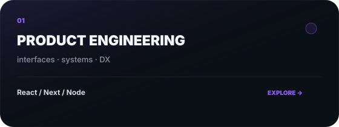</td>
<td width="33%">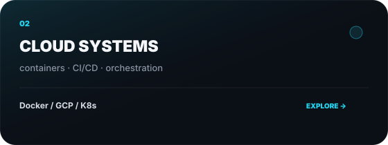</td>
<td width="33%">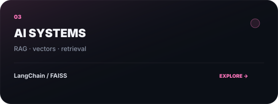</td>
</tr>
<tr>
<td width="33%">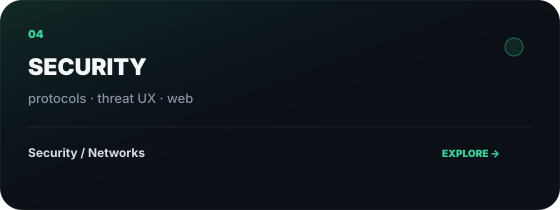</td>
<td width="33%">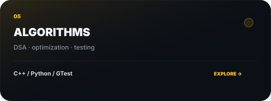</td>
<td width="33%">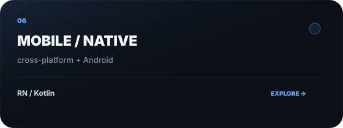</td>
</tr>
</table>

## Projects

<table>
<tr>
<td width="50%"><a href="https://github.com/masked-shinobi/AI-RESUME-ANALYSER"></a></td>
<td width="50%"><a href="https://github.com/masked-shinobi/MinorProject_resembler"></a></td>
</tr>
<tr>
<td width="50%"><a href="https://github.com/masked-shinobi/MCQ_test_Maker_website"></a></td>
<td width="50%"><a href="https://github.com/masked-shinobi/devops_webapp_cloud"></a></td>
</tr>
<tr>
<td width="50%"><a href="https://github.com/masked-shinobi/CyberSecurity_Web_Centinel"></a></td>
<td width="50%"><a href="https://github.com/masked-shinobi/GSAP-website-3d"></a></td>
</tr>
<tr>
<td width="50%"><a href="https://github.com/masked-shinobi/Food-delivery-app-reactnative">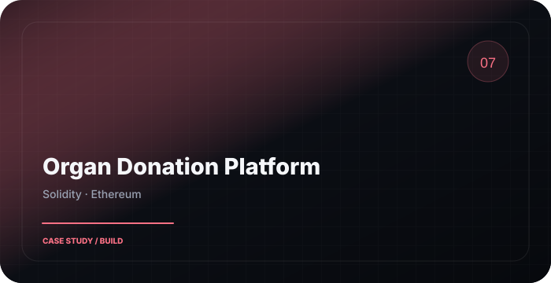</a></td>
<td width="50%"><a href="https://github.com/masked-shinobi/Organ-Donation-Platform-BlockChain">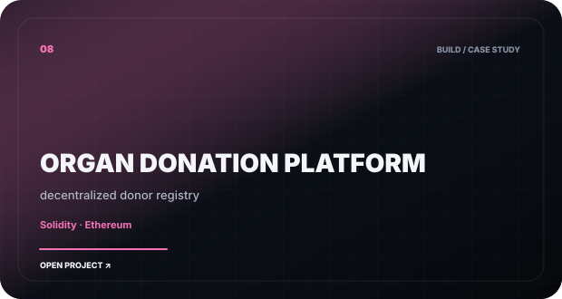</a></td>
</tr>
<tr>
<td width="50%"><a href="https://github.com/masked-shinobi/email-simulator-CN">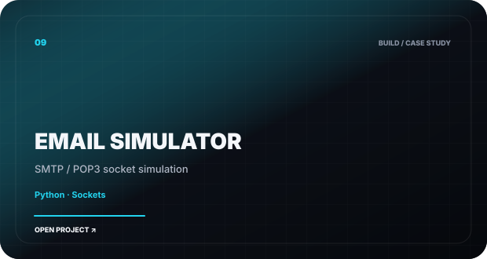</a></td>
<td width="50%"><a href="https://github.com/masked-shinobi/DSA-C-with-gtest">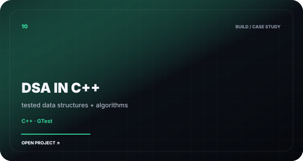</a></td>
</tr>
<tr>
<td width="50%"><a href="https://github.com/masked-shinobi/file-manager-app">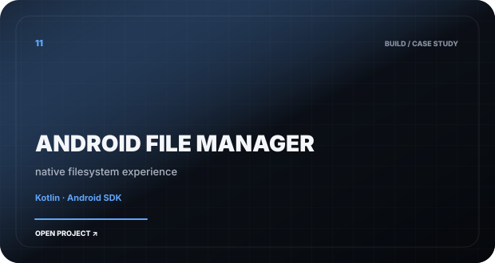</a></td>
<td width="50%"><a href="https://github.com/masked-shinobi/PTS-Algorithm">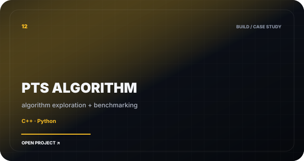</a></td>
</tr>
</table>

<details>
<summary><b>MORE FROM THE LAB ↓</b></summary>

<br/>

| BUILD | DIRECTION |
|---|---|
| RAG Architecture | Modular retrieval + prompt synthesis |
| Ecommerce Devin | AI-assisted e-commerce workflow |
| Tic Tac Toe Docker | Minimal container deployment |
| Python Unit Testing | Testing patterns + boundary analysis |
| SRM Placement Compass | DSA + interview preparation |

</details>

## Stack

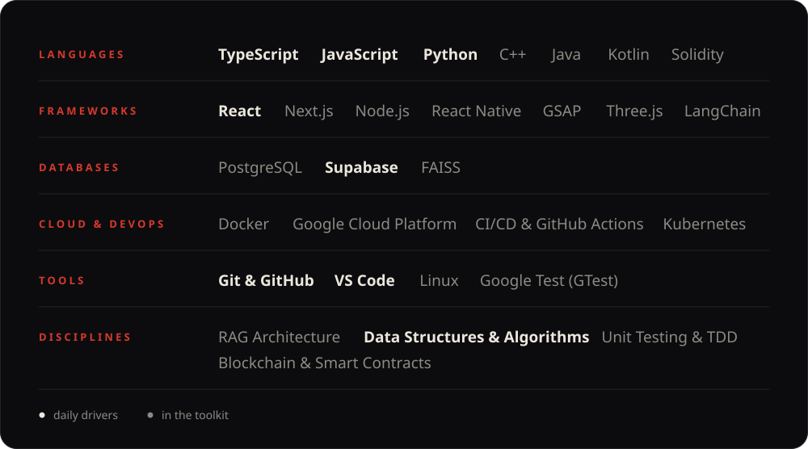

<br/>


## How I Work

<table>
<tr>
<td width="25%" valign="top">

### 01 / THINK

Architecture before implementation.

</td>
<td width="25%" valign="top">

### 02 / CRAFT

Interfaces with purpose.

</td>
<td width="25%" valign="top">

### 03 / VERIFY

Tests, edges, failure paths.

</td>
<td width="25%" valign="top">

### 04 / SHIP

Small releases. Real feedback.

</td>
</tr>
</table>

<details>
<summary><b>EXPERIENCE ↓</b></summary>

<br/>

| CONTEXT | WORK |
|---|---|
| **SRM IST** | B.Tech Computer Science Engineering · Chennai · Merit Scholarship |
| **King Faisal University** | AI / ML research |
| **CJ Network** | Web Engineering |
| **Infosys** | Python Development |

</details>

<details>
<summary><b>CURRENT FOCUS ↓</b></summary>

<br/>

Cloud-native architecture · Retrieval-augmented generation · Developer experience · Cybersecurity interfaces · Algorithms + systems · Production-oriented testing

<br/><br/>

`make it work → make it understandable → make it worth using`

</details>

## Activity

<div align="center">
<picture>
<source media="(prefers-color-scheme: dark)" srcset="https://raw.githubusercontent.com/masked-shinobi/masked-shinobi/output/github-snake-dark.svg">

</picture>
</div>

## Contact

<div align="center">

### BUILD SOMETHING THAT DESERVES A SYSTEM DIAGRAM.

<a href="https://github.com/masked-shinobi"></a>
<a href="https://www.linkedin.com/in/masked-shinobi-30a289377/"></a>
<a href="mailto:maskedprogrammer.in@gmail.com"></a>

<br/><br/>

<sub>SANJAY BASKAR · DESIGN ENGINEER · 2026</sub>

</div>
