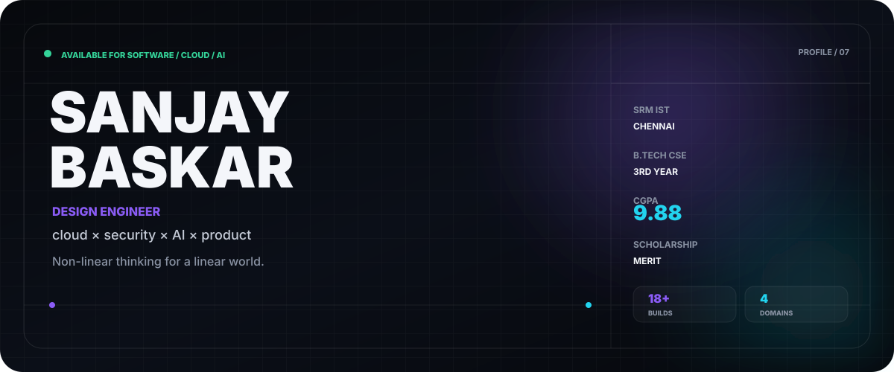
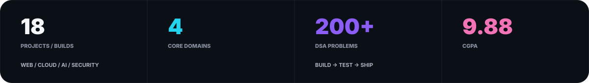
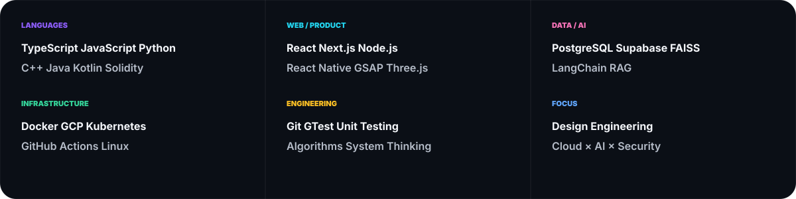
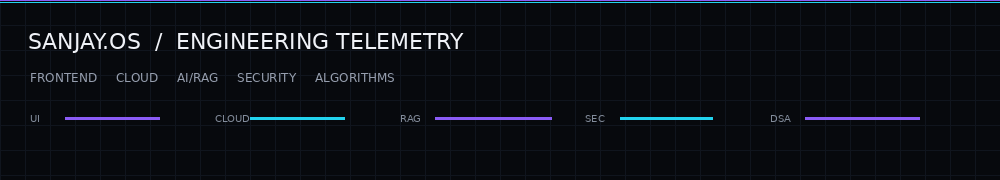

<div align="center">



<br/>

<a href="https://github.com/masked-shinobi"></a>
<a href="https://www.linkedin.com/in/masked-shinobi-30a289377/"></a>
<a href="mailto:maskedprogrammer.in@gmail.com"></a>
<a href="https://drive.google.com/file/d/1QGokMLQhPTLxFkUjbR9Es9ofhuaZsnsl/view?usp=drive_link"></a>

</div>

<br/>



## `SYSTEM / 00` — THE SIGNAL

<table>
<tr>
<td width="62%" valign="top">

### DESIGN ENGINEER × BUILDER

I build digital products where **creative interfaces meet serious engineering**.

My work moves across frontend systems, cloud infrastructure, AI retrieval pipelines, security experiments, mobile applications and algorithmic foundations.

**The goal isn't more technology.**  
It's technology arranged with enough intent that the result feels obvious.

</td>
<td width="38%" valign="top">

```text
THINK
  ↓
DESIGN
  ↓
BUILD
  ↓
TEST
  ↓
SHIP
  ↓
LEARN
```

`SRM IST / CHENNAI`  
`B.TECH CSE / YEAR 3`  
`CGPA / 9.88`

</td>
</tr>
</table>

---

## `SYSTEM / 01` — CAPABILITY GRID

<table>
<tr>
<td width="33%"></td>
<td width="33%"></td>
<td width="33%"></td>
</tr>
<tr>
<td width="33%"></td>
<td width="33%"></td>
<td width="33%"></td>
</tr>
</table>

---

## `SYSTEM / 02` — PROJECT GRID

### SELECTED SYSTEMS / 12 BUILDS

<table>
<tr>
<td width="50%"><a href="https://github.com/masked-shinobi/AI-RESUME-ANALYSER"></a></td>
<td width="50%"><a href="https://github.com/masked-shinobi/MinorProject_resembler"></a></td>
</tr>
<tr>
<td width="50%"><a href="https://github.com/masked-shinobi/MCQ_test_Maker_website"></a></td>
<td width="50%"><a href="https://github.com/masked-shinobi/devops_webapp_cloud"></a></td>
</tr>
<tr>
<td width="50%"><a href="https://github.com/masked-shinobi/CyberSecurity_Web_Centinel"></a></td>
<td width="50%"><a href="https://github.com/masked-shinobi/GSAP-website-3d"></a></td>
</tr>
<tr>
<td width="50%"><a href="https://github.com/masked-shinobi/Food-delivery-app-reactnative"></a></td>
<td width="50%"><a href="https://github.com/masked-shinobi/Organ-Donation-Platform-BlockChain"></a></td>
</tr>
<tr>
<td width="50%"><a href="https://github.com/masked-shinobi/email-simulator-CN"></a></td>
<td width="50%"><a href="https://github.com/masked-shinobi/DSA-C-with-gtest"></a></td>
</tr>
<tr>
<td width="50%"><a href="https://github.com/masked-shinobi/file-manager-app"></a></td>
<td width="50%"><a href="https://github.com/masked-shinobi/PTS-Algorithm"></a></td>
</tr>
</table>

<details>
<summary><b>VIEW THE REST OF THE LAB →</b></summary>

<br/>

| BUILD | DIRECTION |
|---|---|
| RAG Architecture | modular retrieval + prompt synthesis |
| Ecommerce Devin | AI-assisted e-commerce workflow |
| Tic Tac Toe Docker | minimal container deployment |
| Python Unit Testing | testing patterns + boundary analysis |
| SRM Placement Compass | DSA + interview preparation |

</details>

---

## `SYSTEM / 03` — STACK MATRIX



---

## `SYSTEM / 04` — LIVE TELEMETRY



<table>
<tr>
<td width="25%" align="center">

**FRONTEND**

`92%`

</td>
<td width="25%" align="center">

**BACKEND**

`88%`

</td>
<td width="25%" align="center">

**AI / RAG**

`86%`

</td>
<td width="25%" align="center">

**CLOUD**

`82%`

</td>
</tr>
</table>

---

## `SYSTEM / 05` — ENGINEERING DNA

<table>
<tr>
<td width="25%" align="center">

### `01`

**THINK**

Architecture before  
implementation.

</td>
<td width="25%" align="center">

### `02`

**CRAFT**

Interfaces with  
purpose.

</td>
<td width="25%" align="center">

### `03`

**VERIFY**

Tests, edges,  
failure paths.

</td>
<td width="25%" align="center">

### `04`

**SHIP**

Small releases.  
Real feedback.

</td>
</tr>
</table>

---

## `SYSTEM / 06` — EXPERIENCE GRID

<table>
<tr>
<td width="33%" valign="top">

### SRM IST

**Computer Science Engineering**

Chennai · 3rd Year  
CGPA `9.88`  
Merit Scholarship

</td>
<td width="33%" valign="top">

### RESEARCH

**AI / ML**

King Faisal University

Deep learning experimentation  
and applied intelligence.

</td>
<td width="34%" valign="top">

### ENGINEERING

**Industry exposure**

CJ Network → Web Engineering  
Infosys → Python Development

</td>
</tr>
</table>

---

## `SYSTEM / 07` — CURRENT LAB

```text
┌──────────────────────────────────────────────────────────────────────────┐
│ FOCUS                                                                    │
│                                                                          │
│ cloud-native architecture   ·   retrieval-augmented generation          │
│ developer experience        ·   cybersecurity interfaces                │
│ algorithms + systems        ·   production-oriented testing             │
│                                                                          │
│ PRINCIPLE                                                                │
│                                                                          │
│ make it work  →  make it understandable  →  make it worth using         │
└──────────────────────────────────────────────────────────────────────────┘
```

---

## `SYSTEM / 08` — CONNECT

<div align="center">

### BUILD SOMETHING THAT DESERVES A SYSTEM DIAGRAM.

<br/>

<a href="https://github.com/masked-shinobi"></a>
<a href="https://www.linkedin.com/in/masked-shinobi-30a289377/"></a>
<a href="mailto:maskedprogrammer.in@gmail.com"></a>

<br/><br/>

`SANJAY BASKAR` · `DESIGN ENGINEER` · `2026`

</div>
