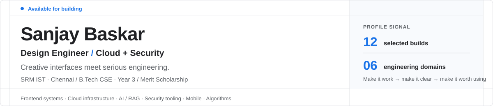
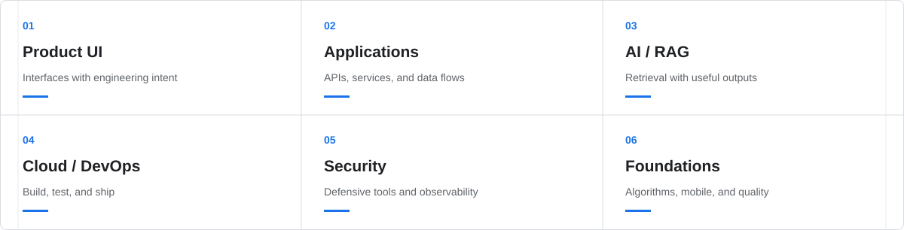
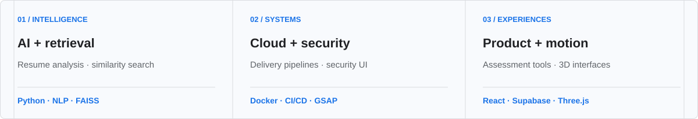

# Sanjay Baskar

<a href="https://github.com/masked-shinobi">GitHub</a> · <a href="https://www.linkedin.com/in/masked-shinobi-30a289377/">LinkedIn</a> · <a href="mailto:maskedprogrammer.in@gmail.com">Email</a> · <a href="https://drive.google.com/file/d/1QGokMLQhPTLxFkUjbR9Es9ofhuaZsnsl/view?usp=drive_link">Resume</a> · <a href="https://masked-shinobi.github.io/masked-shinobi/">Live portfolio</a>

---

## 01 · About

I build digital products where **creative interfaces meet serious engineering**. My work spans frontend systems, cloud infrastructure, AI retrieval pipelines, security tooling, mobile apps, and algorithmic foundations.

> The goal isn't more technology. It's technology arranged with enough intent that the result feels obvious.

**Think → Design → Build → Test → Learn → Ship**

| Public repositories | Stars earned | Followers | Forks |
|:--:|:--:|:--:|:--:|
| **18** | — | — | — |

## 02 · Capabilities

- **Product UI** — Interfaces that feel engineered; React, Next.js, GSAP, and Three.js.
- **Applications** — APIs, services, and data flows; Node.js, Python, REST, and Postgres.
- **AI / RAG** — Retrieval systems with usable outputs; LangChain, FAISS, embeddings, and LLMs.
- **Cloud / DevOps** — Build, test, and ship with confidence; Docker, Actions, Linux, and GCP.
- **Security** — Defensive tooling and observability; web security, auth, monitoring, and threat UI.
- **Foundations** — Algorithms, mobile, and quality; C++, Kotlin, DSA, and gtest.

## 03 · Selected work

**AI & retrieval**

- [AI Resume Analyser](https://github.com/masked-shinobi/AI-RESUME-ANALYSER) — Resume scoring and actionable feedback · Python, NLP.
- [Resembler](https://github.com/masked-shinobi/MinorProject_resembler) — Similarity matching and retrieval · Python, FAISS.

**Cloud & security**

- [DevOps Web App](https://github.com/masked-shinobi/devops_webapp_cloud) — Containerised delivery pipeline · Docker, CI/CD.
- [Web Sentinel](https://github.com/masked-shinobi/CyberSecurity_Web_Centinel) — Security monitoring interface · Security, GSAP.

**Product experiences**

- [MCQ Test Maker](https://github.com/masked-shinobi/MCQ_test_Maker_website) — Create, share, and grade tests · React, Supabase.
- [GSAP 3D Website](https://github.com/masked-shinobi/GSAP-website-3d) — Scroll-driven 3D motion system · GSAP, Three.js.

<strong>Complete project index · six more builds</strong>

- [Food Delivery App](https://github.com/masked-shinobi/Food-delivery-app-reactnative) — Cross-platform ordering flow · React Native, JS.
- [Organ Donation Platform](https://github.com/masked-shinobi/Organ-Donation-Platform-BlockChain) — Transparent donor matching on-chain · Solidity, Ethereum.
- [Email Simulator](https://github.com/masked-shinobi/email-simulator-CN) — Protocol simulation for networking study · Python, Sockets.
- [DSA in C++](https://github.com/masked-shinobi/DSA-C-with-gtest) — Data structures with test coverage · C++, gtest.
- [Android File Manager](https://github.com/masked-shinobi/file-manager-app) — Local file browsing and organisation · Kotlin, Android.
- [PTS Algorithm](https://github.com/masked-shinobi/PTS-Algorithm) — Algorithm implementation and analysis · C++, Python.

<strong>Lab index · systems and experiments</strong>

| Build | Direction | Signal |
|:--|:--|:--|
| Web Sentinel | Security monitoring interface | Security · GSAP |
| GSAP 3D Website | Scroll-driven 3D motion system | GSAP · Three.js |
| Email Simulator | Protocol simulation for networking study | Python · Sockets |
| DSA in C++ | Data structures with test coverage | C++ · gtest |
| Android File Manager | Local file browsing and organisation | Kotlin · Android |
| PTS Algorithm | Algorithm implementation and analysis | C++ · Python |

## 04 · Stack

| Group | Technologies |
|:--|:--|
| Languages | TypeScript · JavaScript · Python · C++ · Java · Kotlin · Solidity |
| Frontend | React · Next.js · GSAP · Three.js · Tailwind |
| Backend | Node.js · Express · REST · PostgreSQL · Supabase |
| AI / Data | RAG · LangChain · FAISS · Embeddings · scikit-learn |
| Cloud | Docker · GCP · GitHub Actions · CI/CD · Linux |
| Quality | Unit testing · gtest · pytest · TDD · Edge cases |

### Engineering telemetry

*Self-assessed signal across interface, services, retrieval, and delivery.*

## 05 · How I work

1. **Think** — Architecture before implementation.
2. **Craft** — Interfaces with purpose.
3. **Verify** — Tests, edges, and failure paths.
4. **Ship** — Small releases and real feedback.

<strong>Experience · timeline</strong>

- **SRM IST** — B.Tech Computer Science Engineering · Chennai · Merit Scholarship.
- **King Faisal University** — AI / ML research · deep learning experimentation and applied intelligence.
- **CJ Network** — Web Engineering.
- **Infosys** — Python Development.

<strong>Current focus · 2026</strong>

Cloud-native architecture · RAG systems · Developer experience · Cybersecurity interfaces · Algorithms + systems · Production testing

*make it work → make it understandable → make it worth using*

## 06 · Activity

## 07 · Contact

### Build something that deserves a system diagram.

[Explore code](https://github.com/masked-shinobi) · [LinkedIn](https://www.linkedin.com/in/masked-shinobi-30a289377/) · [Email](mailto:maskedprogrammer.in@gmail.com)

Sanjay Baskar · Design Engineer · 2026
