<div align="center">

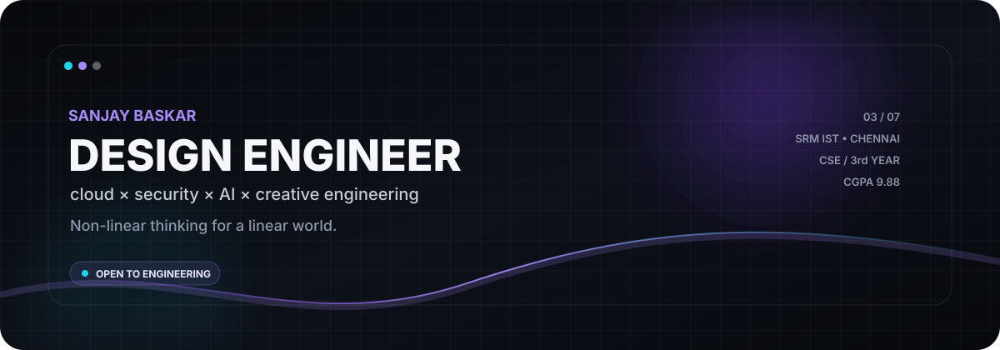

<br/>

<a href="https://github.com/masked-shinobi">

</a>
<a href="https://www.linkedin.com/in/masked-shinobi-30a289377/">

</a>
<a href="mailto:maskedprogrammer.in@gmail.com">

</a>
<a href="https://drive.google.com/file/d/1QGokMLQhPTLxFkUjbR9Es9ofhuaZsnsl/view?usp=drive_link">

</a>

</div>

<br/>

<div align="center">
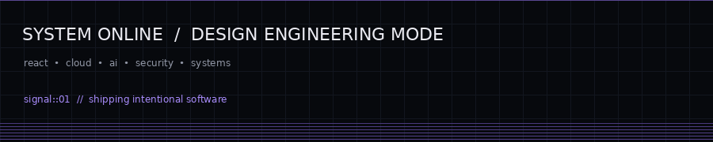
</div>

---

# `SANJAY / BASKAR`

> **Design Engineer · Cloud & Security Developer**
>
> I build digital products where **creative interfaces meet serious engineering**.
> My work moves between frontend systems, cloud infrastructure, AI retrieval pipelines,
> security experiments and the tiny details that make software feel intentional.

<div align="center">

`SRM IST · CHENNAI` &nbsp; · &nbsp; `B.TECH CSE` &nbsp; · &nbsp; `3RD YEAR` &nbsp; · &nbsp; `CGPA 9.88`

</div>

<br/>

<table>
<tr>
<td width="52%" valign="top">

### ◉ THE SHORT VERSION

I'm a Computer Science student who likes the space between **design and implementation**.

I care about:

- interfaces that feel engineered, not assembled
- cloud systems that are reproducible
- AI systems that retrieve before they hallucinate
- security experiences that are understandable
- codebases that survive beyond the demo

**Current direction →** `Design Engineering + Cloud + AI + Security`

</td>
<td width="48%" valign="top">

### ◌ OPERATING PRINCIPLE

```text
01  THINK IN SYSTEMS
02  DESIGN THE EXPERIENCE
03  BUILD THE CORE
04  TEST THE EDGES
05  SHIP THE THING
```

**Non-linear thinking for a linear world.**

</td>
</tr>
</table>

<br/>

## `01` — WHAT I BUILD

<table>
<tr>
<td width="50%">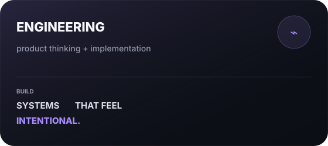</td>
<td width="50%">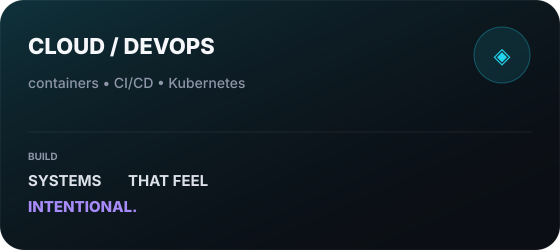</td>
</tr>
<tr>
<td width="50%">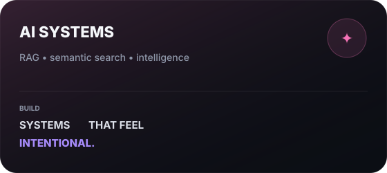</td>
<td width="50%">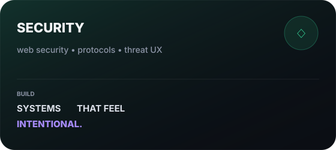</td>
</tr>
</table>

---

## `02` — SELECTED BUILDS

<table>
<tr>
<td width="50%" valign="top">

<a href="https://github.com/masked-shinobi/AI-RESUME-ANALYSER">
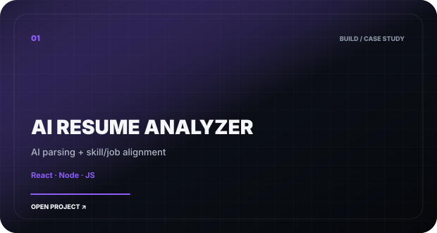
</a>

### AI Resume Analyzer
**AI-powered resume parsing + evaluation**

React · Node.js · JavaScript

> Extracts structured resume signals, computes skill/job alignment and turns the result into actionable optimization feedback.

</td>
<td width="50%" valign="top">

<a href="https://github.com/masked-shinobi/MinorProject_resembler">
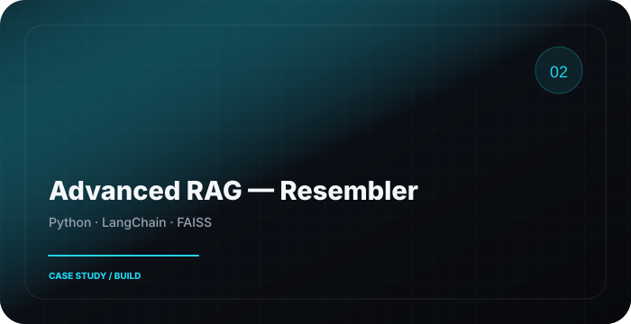
</a>

### Advanced RAG — Resembler
**Semantic retrieval with grounded generation**

Python · LangChain · FAISS

> A production-oriented retrieval pipeline designed around vector search, semantic similarity and citation-grounded answers.

</td>
</tr>

<tr>
<td width="50%" valign="top">

<a href="https://github.com/masked-shinobi/MCQ_test_Maker_website">
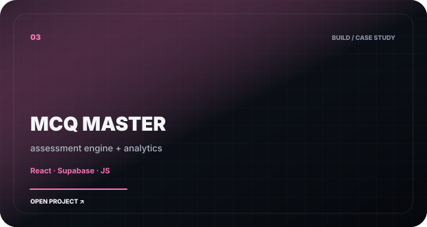
</a>

### MCQ Master
**Interactive assessment platform**

React · Supabase · JavaScript

> Dynamic quiz generation, automated grading, question-bank management and student analytics.

</td>
<td width="50%" valign="top">

<a href="https://marketplace.visualstudio.com/items?itemName=SanjayBaskar.shinobi-black-theme">
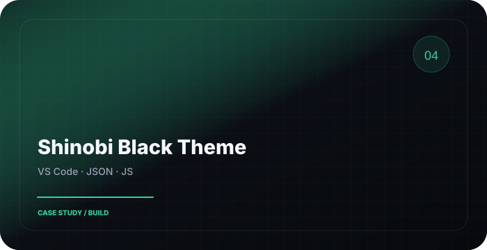
</a>

### Shinobi Black
**OLED-first VS Code theme**

VS Code · JSON · JavaScript

> A true-black developer environment with high-contrast neon syntax and carefully scoped tokens.

</td>
</tr>

<tr>
<td width="50%" valign="top">

<a href="https://github.com/masked-shinobi/devops_webapp_cloud">
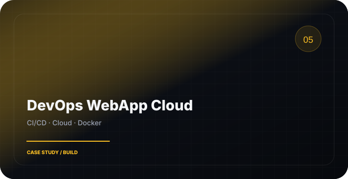
</a>

### DevOps WebApp Cloud
**Containerized cloud deployment**

CI/CD · Docker · Cloud

> Immutable builds, automated testing, image packaging and release automation.

</td>
<td width="50%" valign="top">

<a href="https://github.com/masked-shinobi/Food-delivery-app-reactnative">
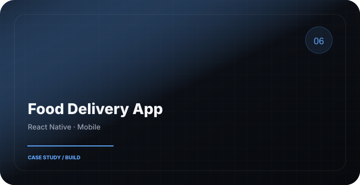
</a>

### Food Delivery App
**Cross-platform mobile product**

React Native · JavaScript · Mobile

> Restaurant feeds, meal selection, cart persistence and simulated order tracking.

</td>
</tr>
</table>

<details>
<summary><b>＋ EXPAND THE LAB — 12 MORE BUILDS</b></summary>

<br/>

| Build | What it explores | Stack |
|---|---|---|
| [RAG Architecture](https://github.com/masked-shinobi/minor_rag_architecture) | modular retrieval + prompt synthesis | Python |
| [CyberSecurity Web Centinel](https://github.com/masked-shinobi/CyberSecurity_Web_Centinel) | threat intelligence UI + GSAP motion | JS · GSAP · CSS |
| [GSAP 3D Website](https://github.com/masked-shinobi/GSAP-website-3d) | spatial UI + 3D camera choreography | Three.js · GSAP |
| [Ecommerce Devin](https://github.com/masked-shinobi/Ecommerce-devin-ai-workflow) | AI-assisted e-commerce workflow | JS · HTML · CSS |
| [Tic Tac Toe Docker](https://github.com/masked-shinobi/Tic-Tac-Toe-Docker) | minimal container deployment | Docker · Linux |
| [Android File Manager](https://github.com/masked-shinobi/file-manager-app) | native filesystem UX | Kotlin · Android |
| [Organ Donation Platform](https://github.com/masked-shinobi/Organ-Donation-Platform-BlockChain) | decentralized consent + registry | Solidity · Ethereum |
| [Email Simulator](https://github.com/masked-shinobi/email-simulator-CN) | SMTP/POP3 from sockets | Python · Networking |
| [DSA in C++](https://github.com/masked-shinobi/DSA-C-with-gtest) | tested data structures + algorithms | C++ · GTest |
| [PTS Algorithm](https://github.com/masked-shinobi/PTS-Algorithm) | custom algorithm exploration | C++ · Python |
| [Python Unit Testing](https://github.com/masked-shinobi/code-unit-testing) | testing patterns + boundaries | Python · unittest |
| [SRM Placement Compass](https://github.com/masked-shinobi/srm-placement-compass) | placement preparation knowledge base | DSA · Markdown |

</details>

---

## `03` — THE TOOLBOX

<table>
<tr>
<td width="33%" valign="top">

**LANGUAGES**

`TypeScript` `JavaScript`  
`Python` `C++` `Java`  
`Kotlin` `Solidity`

</td>
<td width="33%" valign="top">

**PRODUCT / WEB**

`React` `Next.js` `Node.js`  
`React Native` `GSAP` `Three.js`  
`PostgreSQL` `Supabase`

</td>
<td width="34%" valign="top">

**SYSTEMS**

`Docker` `Kubernetes`  
`GCP` `GitHub Actions`  
`Linux` `GTest` `FAISS`  
`RAG Architecture`

</td>
</tr>
</table>

### SIGNAL MAP

```text
FRONTEND       ██████████████████░░  92
BACKEND        █████████████████░░░  88
AI / RAG       █████████████████░░░  86
CLOUD / DEVOPS ████████████████░░░░  82
SECURITY       ███████████████░░░░░  78
ALGORITHMS     ██████████████████░░  90
```

---

## `04` — ENGINEERING DNA

<table>
<tr>
<td width="25%" align="center">

### 01
**BUILD**

From interface  
to infrastructure.

</td>
<td width="25%" align="center">

### 02
**VALIDATE**

Tests, edge cases,  
failure paths.

</td>
<td width="25%" align="center">

### 03
**OPTIMIZE**

Latency, DX,  
clarity and cost.

</td>
<td width="25%" align="center">

### 04
**SHIP**

Small releases.  
Real feedback.

</td>
</tr>
</table>

---

## `05` — CURRENTLY IN THE LAB


```yaml
focus:
  - cloud-native application architecture
  - retrieval-augmented generation
  - developer experience
  - cybersecurity interfaces
  - algorithms & systems

research:
  - AI/ML experimentation
  - semantic retrieval
  - production-oriented testing

philosophy:
  - "make it work"
  - "make it understandable"
  - "make it worth using"
```

---

## `06` — EXPERIENCE / CONTEXT

**SRM Institute of Science & Technology — Chennai**  
`B.Tech Computer Science Engineering` · `3rd Year` · `CGPA 9.88` · `Merit Scholarship`

**Research / Engineering exposure**

`AI / ML Research` → King Faisal University  
`Web Engineering` → CJ Network  
`Python Development` → Infosys

The common thread: **turning ambiguous requirements into working systems.**

---

## `07` — LET'S CONNECT

<div align="center">

### If you're building something ambitious, I'm interested.

**Design systems. Cloud platforms. AI products. Security tooling. Developer tools.**

<br/>

<a href="https://github.com/masked-shinobi">

</a>
<a href="https://www.linkedin.com/in/masked-shinobi-30a289377/">

</a>
<a href="mailto:maskedprogrammer.in@gmail.com">

</a>

<br/><br/>

`masked-shinobi` &nbsp; / &nbsp; `Sanjay Baskar` &nbsp; / &nbsp; `2026`

</div>
