






<a href="https://github.com/masked-shinobi/AI-RESUME-ANALYSER">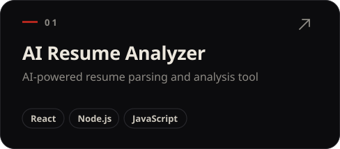</a>
<a href="https://github.com/masked-shinobi/MinorProject_resembler">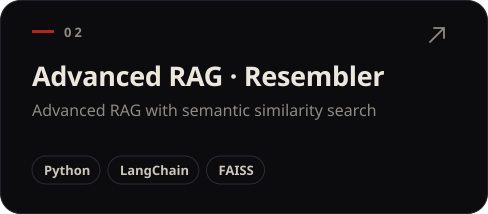</a>
<a href="https://github.com/masked-shinobi/MCQ_test_Maker_website"></a>
<a href="https://marketplace.visualstudio.com/items?itemName=SanjayBaskar.shinobi-black-theme">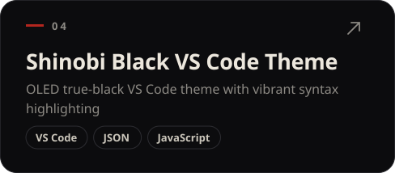</a>
<a href="https://github.com/masked-shinobi/devops_webapp_cloud">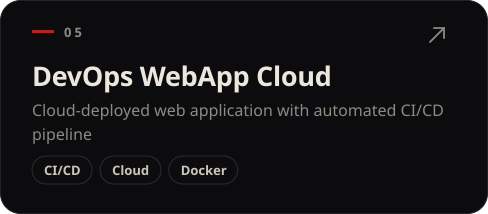</a>
<a href="https://github.com/masked-shinobi/Food-delivery-app-reactnative"></a>
<a href="https://github.com/masked-shinobi/Organ-Donation-Platform-BlockChain"></a>
<a href="https://github.com/masked-shinobi?tab=repositories"></a>


<table width="100%">
<tr><td valign="top" width="33%"><a href="https://github.com/masked-shinobi/minor_rag_architecture"><b>RAG Architecture</b></a> Modular retrieval-augmented generation pipeline <code>Python</code></td><td valign="top" width="33%"><a href="https://github.com/masked-shinobi/CyberSecurity_Web_Centinel"><b>CyberSecurity Web Centinel</b></a> Animated cybersecurity showcase site <code>JS · GSAP · CSS</code></td><td valign="top" width="33%"><a href="https://github.com/masked-shinobi/GSAP-website-3d"><b>GSAP 3D Website</b></a> Immersive 3D web experience <code>GSAP · Three.js</code></td></tr>
<tr><td valign="top" width="33%"><a href="https://github.com/masked-shinobi/Ecommerce-devin-ai-workflow"><b>Ecommerce Devin</b></a> AI-assisted e-commerce workflow <code>JS · HTML · CSS</code></td><td valign="top" width="33%"><a href="https://github.com/masked-shinobi/Tic-Tac-Toe-Docker"><b>Tic Tac Toe Docker</b></a> Containerized game deployment <code>Docker · Linux</code></td><td valign="top" width="33%"><a href="https://github.com/masked-shinobi/file-manager-app"><b>Android File Manager</b></a> Native Kotlin file manager <code>Kotlin · Android SDK</code></td></tr>
<tr><td valign="top" width="33%"><a href="https://github.com/masked-shinobi/email-simulator-CN"><b>Email Simulator</b></a> SMTP/POP3 protocols from scratch <code>Python · Sockets</code></td><td valign="top" width="33%"><a href="https://github.com/masked-shinobi/DSA-C-with-gtest"><b>DSA in C++</b></a> Data structures with GTest suites <code>C++ · GTest</code></td><td valign="top" width="33%"><a href="https://github.com/masked-shinobi/PTS-Algorithm"><b>PTS Algorithm</b></a> Custom algorithm design & optimization <code>C++ · Python</code></td></tr>
<tr><td valign="top" width="33%"><a href="https://github.com/masked-shinobi/code-unit-testing"><b>Python Unit Testing</b></a> Testing patterns & best practices <code>Python · unittest</code></td><td valign="top" width="33%"><a href="https://github.com/masked-shinobi/srm-placement-compass"><b>SRM Placement Compass</b></a> Placement roadmap for SRM students <code>DSA · Markdown</code></td><td valign="top" width="33%"><a href="https://app.notion.com/p/dsa-spreadsheet-sanjaybaskar/73b3a11dd45d8250922601672faf0c8c?v=8d43a11dd45d822db96b08a00fbbd6ef&source=copy_link"><b>DSA Spreadsheet</b></a> My Notion DSA progress tracker <code>Notion</code></td></tr>
</table>



**Open to collaborations on creative frontends, cloud platforms and AI products.**

